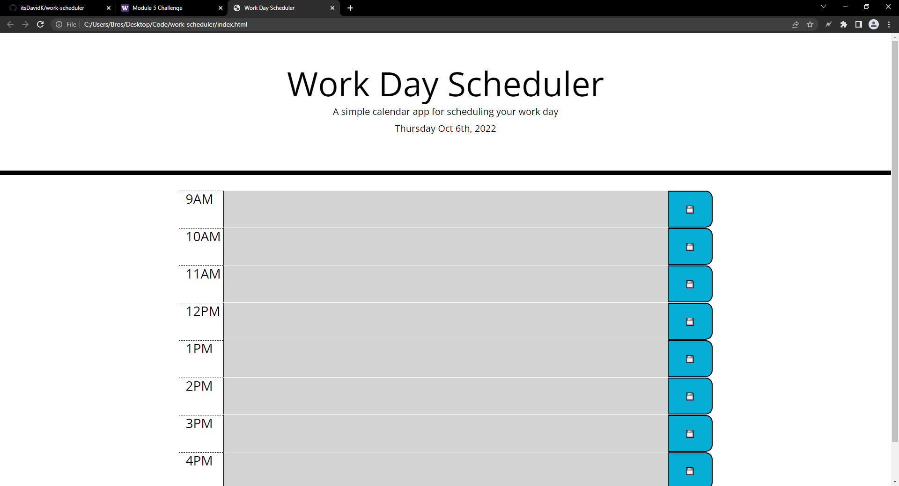
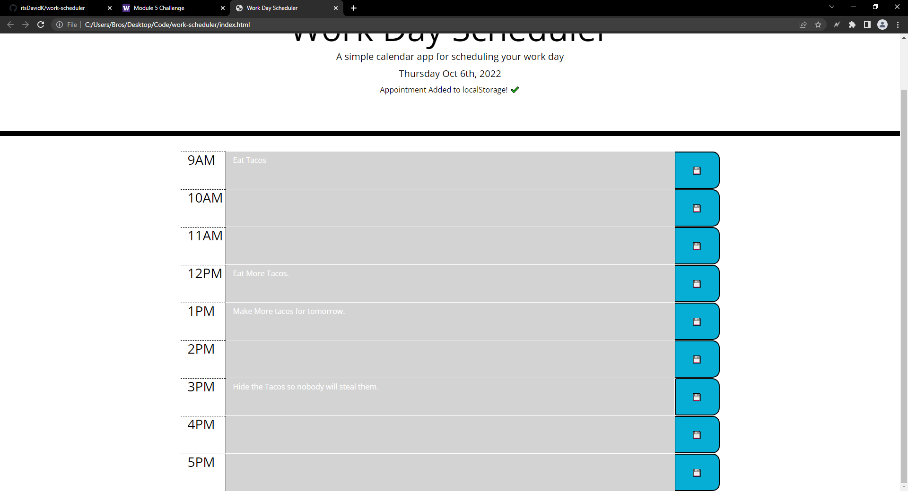

# work-scheduler
Work-Scheduler is a simple webpage that allows the user to create a schedule for today's work.
The user can Add, and edit text for each hour of the work day.
The background of the description will change to gray if its the present, red if its the current, hour, and green if its the future.

## Contributing
Pull requests are welcome. For major changes, please open an issue first to discuss what you would like to change.

Please make sure to update tests as appropriate.

## Website Screenshot

## Link To The Website
https://itsdavidk.github.io/work-scheduler
